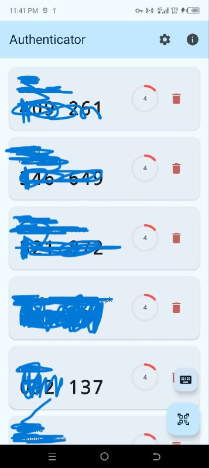
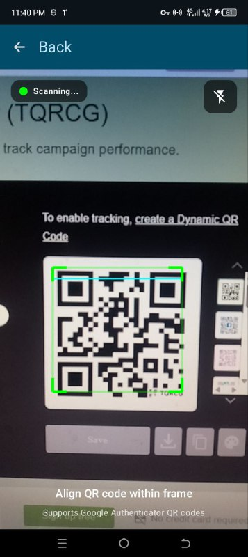
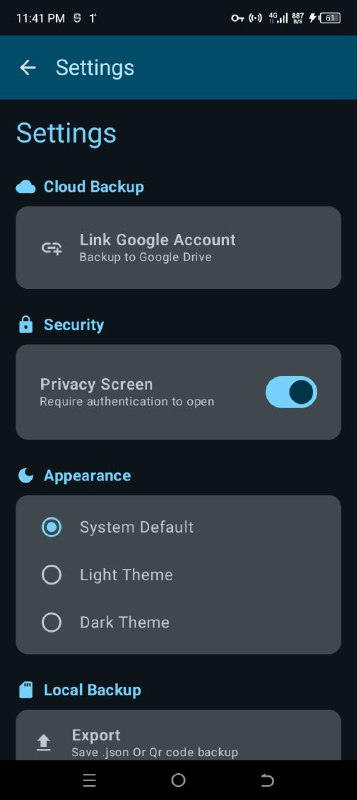
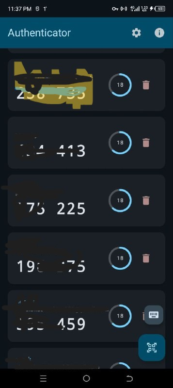

# 🔐 OtpAuth - Secure 2FA Authenticator with Cloud Sync

**OtpAuth** is a modern, privacy-focused Two-Factor Authentication (TOTP) app for Android built entirely with **Kotlin** and **Jetpack Compose**. It offers robust security features including biometric protection, zero-knowledge cloud backups via Google Drive, and full offline support.

Designed for security enthusiasts who want full control over their 2FA tokens without relying on proprietary, lock-in solutions.

---

## 📸 Screenshots

| Home Screen | Scan QR | Settings | Dark Mode |
|:-----------:|:-------:|:--------:|:---------:|
|  |  |  |  |

*(Note: Replace the image paths above with your actual uploaded screenshots)*

---

## 🚀 Key Features

### 🔐 Security First
* **Zero-Knowledge Encryption:** All backups (Cloud & Local) are encrypted with **AES-256-GCM** using a custom password before leaving the device.
* **Biometric Protection:** Secure the app launch and critical actions (like deleting accounts or overwriting backups) with **Fingerprint** or **Face ID**.
* **Secure Storage:** Keys are stored in `EncryptedSharedPreferences` backed by the Android Keystore System.
* **Privacy Screen:** Prevents screenshots and obscures app content in the "Recent Apps" view.

### ☁️ Cloud & Local Sync
* **Google Drive Sync:** Seamlessly backup/restore your accounts to a hidden, secure folder in your personal Google Drive (`appDataFolder`).
* **Local Import/Export:** Export your vault to an encrypted `.json` file for offline storage or transfer between devices.
* **Overwrite Protection:** Biometric confirmation is required before overwriting existing cloud or local backups.

### 📲 User Experience
* **Google Authenticator Migration:** Supports scanning `otpauth-migration://` QR codes to easily transfer accounts from Google Authenticator.
* **Modern UI:** Built with **Material 3** and **Jetpack Compose** for a smooth, adaptive experience.
* **Theming:** Full support for **Dark Mode**, Light Mode, and System Default.
* **ML Kit Scanner:** Fast and accurate QR code scanning using Google's ML Kit and CameraX.

---

## 🛠️ Tech Stack & Libraries

* **Language:** [Kotlin](https://kotlinlang.org/)
* **UI Framework:** [Jetpack Compose](https://developer.android.com/jetpack/compose) (Material3)
* **Architecture:** MVVM (Model-View-ViewModel)
* **Asynchronous:** Kotlin Coroutines & Flow
* **Security:**
    * `androidx.security:security-crypto` (EncryptedSharedPreferences)
    * `androidx.biometric` (BiometricPrompt)
    * `javax.crypto` (AES/GCM/NoPadding)
* **Cloud/Network:**
    * [Google Drive API v3](https://developers.google.com/drive) (Rest V3)
    * [Google Sign-In](https://developers.google.com/identity/sign-in/android)
* **Camera/Scanning:**
    * [CameraX](https://developer.android.com/training/camerax)
    * [ML Kit Barcode Scanning](https://developers.google.com/ml-kit/vision/barcode-scanning)
* **Data Serialization:** [Gson](https://github.com/google/gson) (JSON Parsing)

---

## ⚙️ Setup & Installation

### Prerequisites
* Android Studio Ladybug (or newer)
* JDK 17+
* A Google Cloud Project (for Drive Sync)

### 1. Clone the Repository
```bash
git clone [https://github.com/shoaibhassan2/OtpAuth.git](https://github.com/shoaibhassan2/OtpAuth.git)
cd OtpAuth